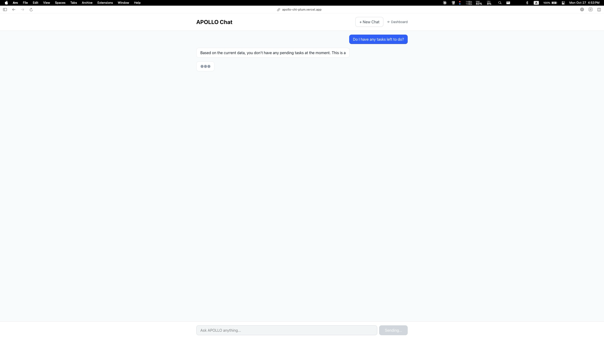
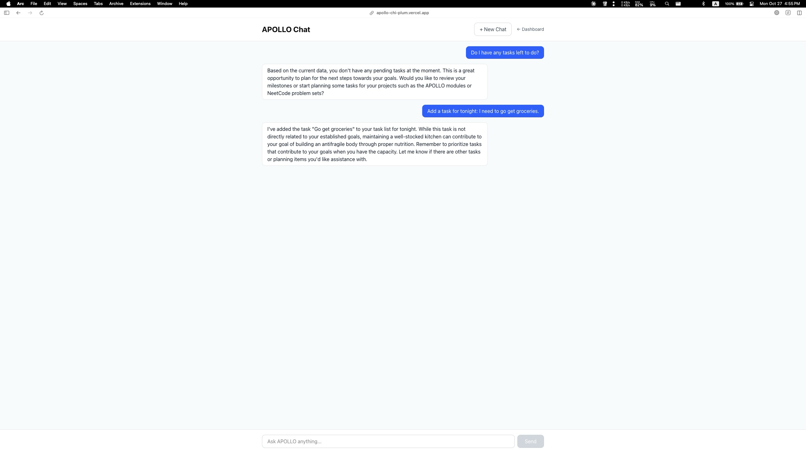
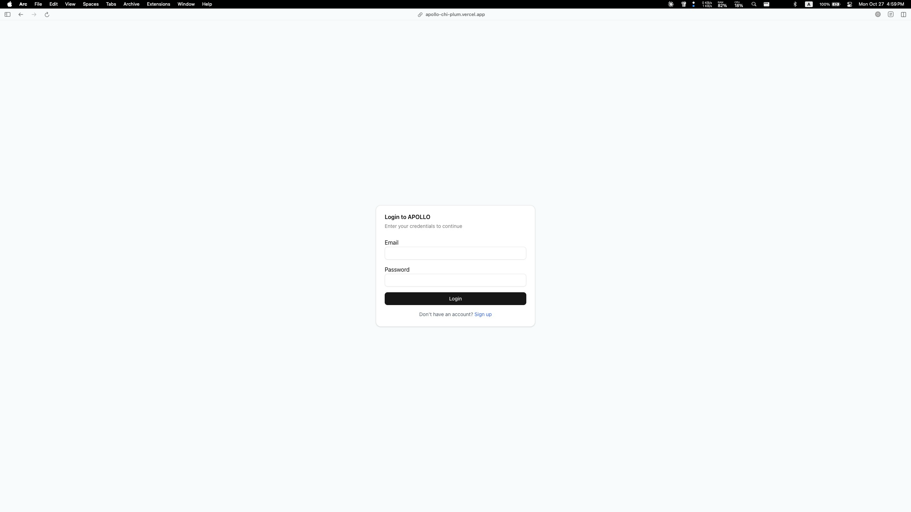

# APOLLO

**Autonomous Productivity & Optimization Life Logic Orchestrator**

A production-grade AI agent system for strategic productivity and life planning. Built as a full-stack portfolio capstone demonstrating AI architecture, secure tool execution, and streaming interfaces.

> *Renamed from ATLAS to APOLLO (Oct 2025) to differentiate from OpenAI's Atlas browser*

[](https://apollo-frontend.vercel.app)
[](https://apollo-backend.onrender.com)
[]()

**🚀 Live at:** [apollo-frontend.vercel.app](https://apollo-frontend.vercel.app)

---

## 📸 Demo

### AI Chat with Streaming Responses


The AI responds with strategic advice connecting your daily tasks to long-term goals.

### Function Calling in Action


Say "Add task to buy groceries" and watch APOLLO create the task in real-time.

### Authentication Flow


Secure JWT-based authentication with bcrypt password hashing.

---

## 🎯 What Makes This Different

Most productivity apps are glorified to-do lists. APOLLO is an **AI system that thinks strategically** about your goals:

```
You: "What should I focus on today?"

APOLLO: "Based on your current tasks and goals, I recommend:

1. Complete Module 2.1 Phase 3 (~2 hours). This advances your APOLLO 
   portfolio milestone, which builds toward your Spring 2027 SWE goal.

2. After that, tackle NeetCode: Valid Anagram (~30 min). This reinforces 
   your CS fundamentals and prepares you for technical interviews.

3. Zone 2 cardio session (30 min). This maintains your concurrent training 
   goal for an antifragile body.

Remember, completing Module 2.1 Phase 3 is crucial - it's your highest-
leverage task connecting to your primary goal."
```

**Not just advice** - APOLLO can execute:
```
You: "Add a task to review Module 2.1 notes"
APOLLO: [creates task in database] "I've added 'Review Module 2.1 notes' 
        to your list. Given your current schedule, I suggest fitting this 
        in after your NeetCode session around 7 PM."
```

---

## ✨ Features

### 🤖 AI Agent with Strategic Intelligence
- **LifeCoordinator Agent** - Multi-horizon planning across day/week/month/year
- **Goal Hierarchy Thinking** - Tasks → Projects → Milestones → Goals
- **Context-Aware** - Knows your actual tasks, progress, and constraints
- **95% Confidence Rule** - Asks clarifying questions when uncertain

### ⚡ Secure Function Calling
- **Natural Language Actions** - Create, update, delete tasks via conversation
- **Security-First Design** - Agent requests, system validates and executes
- **Ownership Verification** - user_id injection prevents cross-user access
- **Field Whitelisting** - Agent can't modify unauthorized fields

### 🌊 Streaming Responses
- **Server-Sent Events (SSE)** - Word-by-word display like ChatGPT
- **Hybrid Execution Mode** - Streams conversation, instant actions
- **Smart Routing** - Keyword detection routes to appropriate mode
- **Production UX** - Feels responsive and alive

### 💾 Conversation Persistence
- **Auto-Save Chat History** - All conversations stored in database
- **Auto-Load Last Conversation** - Seamless continuation across sessions
- **New Chat Functionality** - Start fresh conversations anytime
- **Message Pagination** - Efficient loading of long conversations

### 🔐 Enterprise-Grade Auth
- **JWT Authentication** - OAuth2 bearer tokens
- **bcrypt Password Hashing** - Industry-standard security
- **Protected Routes** - All task endpoints require authentication
- **User Isolation** - Can only access your own data

### 📊 Full CRUD Task Management
- Create, Read, Update, Delete tasks via REST API
- Status tracking (pending, in_progress, completed)
- Flexible filtering (by user, by status)
- Partial updates (PATCH semantics)

---

## 🛠️ Tech Stack

### Backend


- **FastAPI** - Modern async Python web framework
- **Supabase** - Hosted PostgreSQL with auto-generated REST API
- **OpenAI** - GPT-4 for AI agent intelligence
- **Pydantic** - Data validation with type hints
- **python-jose** - JWT implementation
- **bcrypt** - Password hashing

### Frontend


- **Next.js 15** - React framework with App Router
- **TypeScript** - Type-safe development
- **shadcn/ui** - Component library (Radix UI + Tailwind)
- **Tailwind CSS** - Utility-first styling

### Infrastructure


- **Render** - Backend deployment (FastAPI)
- **Vercel** - Frontend deployment (Next.js)
- **Supabase** - Database hosting

---

## 🏗️ Architecture

### System Overview

```
┌──────────────────────────────────────────────────────────────────┐
│                         FRONTEND (Vercel)                         │
│  Next.js 15 + React + TypeScript + Tailwind + shadcn/ui         │
│                                                                   │
│  ┌─────────────┐  ┌─────────────┐  ┌─────────────┐             │
│  │   Login     │  │  Dashboard  │  │    Chat     │             │
│  │   /login    │  │  /dashboard │  │   /chat     │             │
│  └─────────────┘  └─────────────┘  └─────────────┘             │
│          │                │                 │                    │
│          └────────────────┴─────────────────┘                    │
│                          │                                        │
│                    JWT Bearer Token                              │
│                          │                                        │
└──────────────────────────┼────────────────────────────────────────┘
                           │
                           ▼
┌──────────────────────────────────────────────────────────────────┐
│                      BACKEND (Render)                             │
│                  FastAPI + Python 3.13                           │
│                                                                   │
│  ┌────────────────────────────────────────────────────────────┐ │
│  │  API Routes                                                 │ │
│  │  • /auth/* (register, login, me)                           │ │
│  │  • /tasks/* (CRUD operations)                              │ │
│  │  • /chat (streaming SSE)                                   │ │
│  │  • /conversations/* (history, persistence)                 │ │
│  └────────────────────────────────────────────────────────────┘ │
│           │                                    │                  │
│           ▼                                    ▼                  │
│  ┌─────────────────────┐           ┌────────────────────────┐   │
│  │   AI Agent System   │           │  Authentication Layer  │   │
│  │                     │           │                        │   │
│  │  LifeCoordinator    │           │  • JWT validation      │   │
│  │  • Strategic advice │           │  • Password hashing    │   │
│  │  • Function calling │           │  • User context        │   │
│  │  • Context mgmt     │           │                        │   │
│  └─────────────────────┘           └────────────────────────┘   │
│           │                                                       │
│           ▼                                                       │
│  ┌─────────────────────┐                                        │
│  │    Task Tools       │                                        │
│  │  • create_task()    │                                        │
│  │  • update_task()    │                                        │
│  │  • delete_task()    │                                        │
│  │  • Ownership checks │                                        │
│  └─────────────────────┘                                        │
└──────────────────────────┼────────────────────────────────────────┘
                           │
                           ▼
┌──────────────────────────────────────────────────────────────────┐
│                    DATABASE (Supabase)                            │
│                      PostgreSQL                                   │
│                                                                   │
│  ┌──────────────┐  ┌──────────────┐  ┌─────────────────────┐   │
│  │    users     │  │    tasks     │  │   conversations     │   │
│  │  • id (UUID) │  │  • id (UUID) │  │   • id (UUID)       │   │
│  │  • email     │  │  • user_id   │  │   • user_id         │   │
│  │  • password  │  │  • title     │  │   • title           │   │
│  │  • created   │  │  • status    │  │   • created_at      │   │
│  └──────────────┘  └──────────────┘  └─────────────────────┘   │
│                                              │                    │
│                                              ▼                    │
│                                    ┌─────────────────────┐       │
│                                    │     messages        │       │
│                                    │  • id (UUID)        │       │
│                                    │  • conversation_id  │       │
│                                    │  • role (user/ai)   │       │
│                                    │  • content          │       │
│                                    └─────────────────────┘       │
└──────────────────────────────────────────────────────────────────┘
                           │
                           ▼
┌──────────────────────────────────────────────────────────────────┐
│                      OpenAI API                                   │
│                      GPT-4 Model                                  │
└──────────────────────────────────────────────────────────────────┘
```

### Backend Structure

```
backend/app/
├── agents/                      # AI Agent system
│   ├── base.py                  # BaseAgent ABC interface
│   ├── life_coordinator.py      # Strategic planning agent
│   ├── context.py               # Context management & token budgeting
│   ├── token_utils.py           # LRU-cached token counting (99% faster)
│   └── tools/
│       └── task_tools.py        # CRUD operations with security
├── auth/                        # JWT authentication
│   ├── dependencies.py          # OAuth2PasswordBearer, get_current_user
│   └── jwt.py                   # Token creation/verification
├── db/                          # Database layer
│   └── supabase_client.py       # Supabase connection
├── models/                      # Pydantic data models
│   ├── user.py                  # User models
│   ├── task.py                  # Task models
│   ├── conversation.py          # Conversation models
│   └── message.py               # Message models
├── routes/                      # API endpoints
│   ├── auth.py                  # /auth/* endpoints
│   ├── tasks.py                 # /tasks/* endpoints
│   ├── chat.py                  # /chat endpoint (streaming)
│   └── conversations.py         # /conversations/* endpoints
└── main.py                      # FastAPI application
```

### Frontend Structure

```
frontend/
├── app/
│   ├── login/                   # Login page
│   ├── register/                # Registration page  
│   ├── dashboard/               # Protected dashboard
│   ├── chat/                    # AI chat interface
│   └── layout.tsx               # Root layout
├── components/
│   ├── ui/                      # shadcn/ui components
│   └── LoginForm.tsx            # Auth components
└── lib/
    ├── api.ts                   # Type-safe API wrapper
    └── auth.ts                  # Auth utilities
```

### Agent Architecture

```
┌─────────────────────────────────────────────────────────────┐
│  User: "Add task to buy milk"                               │
└───────────────────────┬─────────────────────────────────────┘
                        │
                        ▼
┌─────────────────────────────────────────────────────────────┐
│  LifeCoordinator Agent (GPT-4)                              │
│  - Analyzes: User wants to create task                      │
│  - Decides: Should call create_task()                       │
│  - Returns: Function call request                           │
│    {"name": "create_task", "arguments": {"title": "..."}}   │
└───────────────────────┬─────────────────────────────────────┘
                        │
                        ▼
┌─────────────────────────────────────────────────────────────┐
│  TaskTools (Secure Execution Layer)                         │
│  - Validates: user_id from auth (not from agent!)           │
│  - Checks: Input validation, ownership                      │
│  - Executes: Actual database INSERT                         │
│  - Returns: {"id": "...", "title": "Buy milk"}              │
└───────────────────────┬─────────────────────────────────────┘
                        │
                        ▼
┌─────────────────────────────────────────────────────────────┐
│  Agent (2nd API Call)                                       │
│  - Receives: Function execution result                      │
│  - Generates: "I've added 'Buy milk' to your tasks!         │
│    You now have 5 pending tasks. Consider prioritizing      │
│    Module 2.1 as it advances your Spring 2027 goal."        │
└─────────────────────────────────────────────────────────────┘
```

**Key Insight:** Agent requests actions but doesn't execute them. System maintains control.

---

## 🔒 Security Model

### Authentication Flow
1. User registers → Password hashed with bcrypt → Stored in database
2. User logs in → Credentials verified → JWT token issued (24h expiry)
3. Protected requests → JWT validated → User identity extracted
4. All task operations → Filtered by authenticated user_id

### Agent Security
1. **Agent is untrusted** - Treats AI as external actor
2. **System validates everything** - Ownership checks, input validation
3. **user_id injection** - Agent can't specify user_id (we inject from auth)
4. **Field whitelisting** - Agent can only modify approved fields
5. **Audit capability** - All tool calls logged for review

---

## 📈 Performance Optimizations

### Token Counting with LRU Cache
```python
@lru_cache(maxsize=10)
def _get_encoding_cached(model: str):
    # First call: 100ms (loads tokenizer)
    # Cached calls: 0.1ms (99% faster!)
```

### Context Window Management
- **Budget:** GPT-4 has 8,192 token context window
- **Strategy:** Fetch only 20 most recent tasks (~800 tokens)
- **Prioritization:** Recent > old, active > completed
- **Future:** Semantic search for relevant context

### Database Queries
- **Indexed columns:** user_id, status, created_at, conversation_id
- **Limit results:** Default 20 tasks (token budget)
- **Filter at DB:** `.eq("user_id", user_id)` not Python filtering
- **CASCADE deletes:** Automatic cleanup of related records

---

## 🚀 Deployment

### Live Instances

**Frontend:** [apollo-frontend.vercel.app](https://apollo-frontend.vercel.app) (Vercel)  
**Backend:** [apollo-backend.onrender.com](https://apollo-backend.onrender.com) (Render)  
**Database:** Supabase (PostgreSQL)

### Environment Variables

**Backend (.env)**
```bash
SUPABASE_URL=your_supabase_url
SUPABASE_KEY=your_supabase_anon_key
JWT_SECRET_KEY=your_jwt_secret
OPENAI_API_KEY=your_openai_key
```

**Frontend (.env.local)**
```bash
NEXT_PUBLIC_API_URL=https://apollo-backend.onrender.com
```

### Deployment Commands

**Backend (Render)**
```bash
# Build command
pip install -r requirements.txt

# Start command
uvicorn app.main:app --host 0.0.0.0 --port $PORT
```

**Frontend (Vercel)**
```bash
# Build command
npm run build

# Auto-detected by Vercel
```

---

## 💻 Local Development Setup

### Prerequisites
- Python 3.13+
- Node.js 18+
- Supabase account
- OpenAI API key

### Backend Setup

```bash
# Navigate to backend directory
cd backend

# Create virtual environment
python -m venv venv
source venv/bin/activate  # On Windows: venv\Scripts\activate

# Install dependencies
pip install -r requirements.txt

# Create .env file (see Environment Variables above)
cp .env.example .env

# Run development server
uvicorn app.main:app --reload --port 8000
```

Backend runs at: http://localhost:8000  
API docs at: http://localhost:8000/docs

### Frontend Setup

```bash
# Navigate to frontend directory
cd frontend

# Install dependencies
npm install

# Create .env.local file
echo "NEXT_PUBLIC_API_URL=http://localhost:8000" > .env.local

# Run development server
npm run dev
```

Frontend runs at: http://localhost:3000

### Database Setup

1. Create Supabase project at [supabase.com](https://supabase.com)
2. Run SQL from `backend/sql/schema.sql` in Supabase SQL Editor
3. Copy connection details to `.env`

---

## 🎓 Learning Outcomes

This project demonstrates mastery of:

**Backend Development:**
- RESTful API design (FastAPI)
- Database modeling (PostgreSQL, foreign keys, indexes, CASCADE)
- Authentication patterns (JWT, OAuth2, bcrypt)
- Async programming (Python asyncio)
- Input validation (Pydantic V2)

**AI/ML Engineering:**
- OpenAI Chat Completions API
- Function calling (tool definition, execution, security)
- Context management (token budgeting, data prioritization)
- System prompt engineering (behavior design)
- Multi-turn conversations (state management)
- Streaming responses (SSE)

**Frontend Development:**
- Next.js 15 App Router
- React hooks (useState, useEffect, useRef)
- TypeScript (generic types, interfaces)
- API integration (fetch, JWT handling, streaming)
- Component architecture (shadcn/ui)

**System Design:**
- Abstract Base Class pattern (polymorphism)
- Separation of concerns (agents, tools, routes)
- Security-first architecture (untrusted actors)
- Performance optimization (caching, token budgeting)

**DevOps:**
- Production deployment (Render + Vercel)
- Environment variable management
- CORS configuration
- Database migrations

**Interview-Ready Topics:**
- "I built a multi-agent AI system with secure function calling"
- "Implemented LRU caching for 99% performance improvement"
- "Designed strategic system prompts with goal-hierarchy thinking"
- "Enforced security in AI systems with validation layers"
- "Deployed full-stack app to production with CI/CD"

---

## 📊 Project Metrics

**Development Time:** 5 days (Oct 22-27, 2025)  
**Total Lines of Code:** ~3,500+  
**Technologies Used:** 15+  
**API Endpoints:** 12  
**Database Tables:** 4 (users, tasks, conversations, messages)

**Modules Completed:**
- ✅ Module 1.1: FastAPI Setup
- ✅ Module 1.2: Database Integration  
- ✅ Module 1.3: Task Management CRUD
- ✅ Module 1.4: Authentication
- ✅ Module 1.5: Frontend Development
- ✅ Module 2.1: AI Agent Foundation
- ✅ Module 2.2: Conversation Persistence

---

## 🚧 Future Enhancements

### Phase 3: Enhanced Context (Planned)
- **Calendar Integration** - Schedule awareness for planning
- **Energy Tracking** - Capacity-aware task recommendations
- **User Preferences** - Learn and adapt to communication style
- **Goal Management** - Full CRUD for goals and milestones

### Phase 4: Multi-Agent System (Vision)
- **Specialized Sub-Agents:**
  - Task Manager (breakdown and estimation)
  - Deep Work Analyzer (productivity insights)
  - Schedule Optimizer (deadline-aware planning)
- **Agent Coordination** - Multi-agent orchestration
- **Advanced Context** - Vector database for semantic search
- **Mobile App** - React Native companion

---

## 🤝 Acknowledgments

**Teaching Methodology:**
- 60/40 manual coding to AI assistance ratio
- Problem-first learning approach
- Quality gates at module completion
- Comprehensive documentation for knowledge retention

**Technologies:**
- OpenAI for GPT-4 API
- Supabase for database infrastructure
- Vercel for frontend deployment
- Render for backend deployment
- shadcn/ui for component library

---

## 📬 Contact

**Jaymin Chang**  
MS Computer Science Student @ Northeastern University (Align Program)  
Targeting visa-sponsored SWE roles (Spring 2027)

**Portfolio:** [portfolio.jayminchang.com](https://portfolio.jayminchang.com) *(coming soon)*  
**GitHub:** [github.com/jmin1219](https://github.com/jmin1219)  
**Email:** chang.jaym@northeastern.edu  
**LinkedIn:** [linkedin.com/in/jaymin-chang](https://linkedin.com/in/jaymin-chang)

---

## 📄 License

MIT License - Feel free to learn from this code!

---

**Status:** ✅ Production-Ready | **Last Updated:** October 27, 2025  
**Portfolio Project** | **Interview-Ready Demo** | **Production Deployment**

*Built with strategic thinking in Vancouver, BC 🇨🇦*
